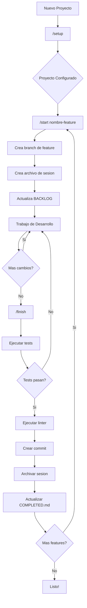
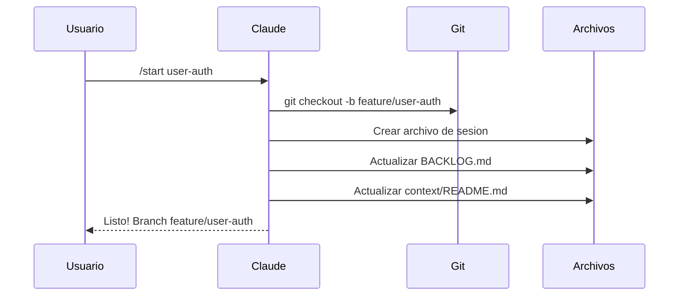
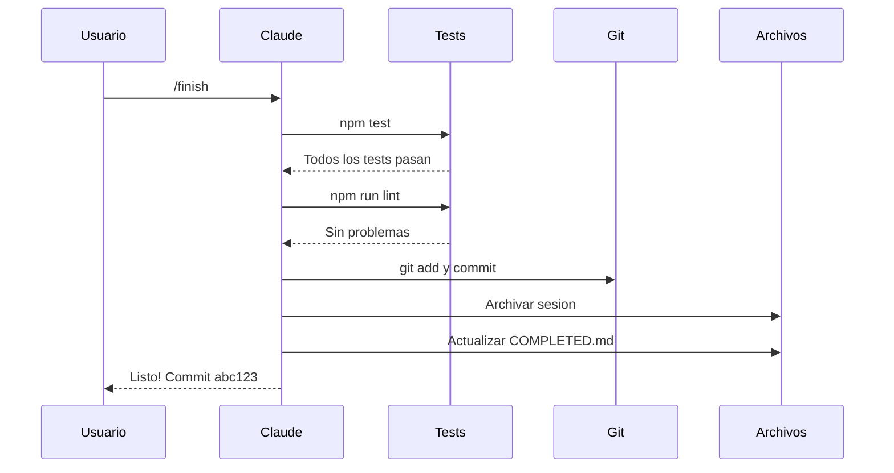
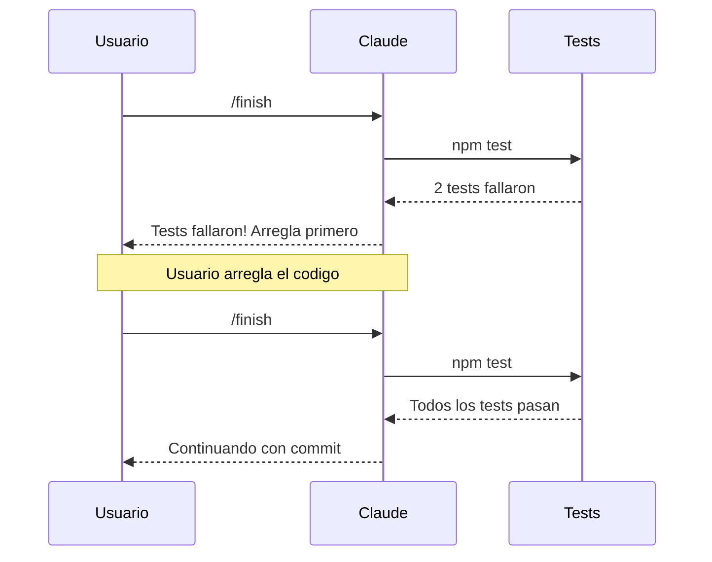
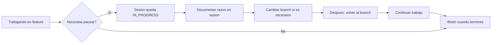
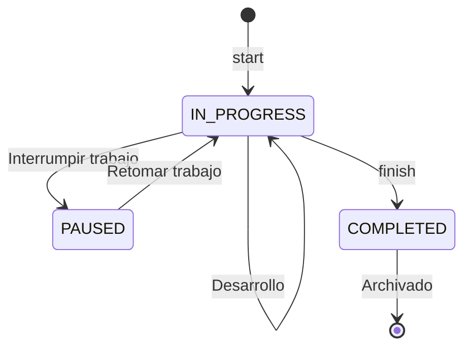

# workflowIA

[](https://claude.ai/claude-code)
[](https://opensource.org/licenses/MIT)

**[Read in English](README.md)**

Template de proyecto configurable para desarrollo asistido por IA con Claude Code. Proporciona seguimiento de sesiones, flujos de trabajo estructurados y trazabilidad del desarrollo.

## Características

- **Wizard de Configuración** (`/setup`) - Configura tu proyecto con preguntas guiadas
- **Seguimiento de Sesiones** - Documenta cada sesión de desarrollo automáticamente
- **Flujo Estructurado** - Inicia y finaliza features con `/start` y `/finish`
- **Todo Configurable** - Package manager, comandos, convenciones git, idiomas
- **Integración MCP** - Busca, explora e instala MCP servers
- **Soporte Bilingüe** - Preferencias de idioma para código y chat

## Inicio Rápido

### 1. Clonar o Usar Template

```bash
# Clonar el repositorio
git clone https://github.com/brujoh88/workflowIA.git mi-proyecto
cd mi-proyecto

# O usar el botón "Use this template" de GitHub
```

### 2. Inicializar Git (si es proyecto nuevo)

```bash
git init
```

### 3. Ejecutar Wizard de Configuración

Abre Claude Code y ejecuta:

```
/setup
```

### 4. Comienza a Desarrollar

```
/start mi-feature    # Crea branch + seguimiento de sesión
... tu trabajo ...
/finish              # Ejecuta tests + commit + archiva sesión
```

---

## Diagrama de Flujo



---

## Escenarios Comunes

### Escenario 1: Iniciando un Nuevo Feature



### Escenario 2: Finalizando un Feature Exitosamente



### Escenario 3: Tests Fallan



### Escenario 4: Pausando el Trabajo



---

## Estructura del Proyecto

```
.
├── .claude/
│   ├── project.config.json    # Configuración del proyecto
│   ├── skills/
│   │   ├── setup/             # Wizard de configuración
│   │   ├── start/             # Flujo de inicio de feature
│   │   ├── finish/            # Flujo de finalización de feature
│   │   └── mcp/               # Gestión de MCP servers
│   ├── agents/                # Agentes especializados
│   └── rules/                 # Reglas por contexto
├── context/
│   ├── README.md              # Índice de sesiones
│   ├── BACKLOG.md             # Backlog de tareas
│   ├── tmp/                   # Sesiones activas
│   └── archive/               # Sesiones archivadas
├── CLAUDE.md                  # Instrucciones del proyecto para Claude
└── CLAUDE.local.md            # Config local (no se commitea)
```

## Configuración

Toda la configuración se guarda en `.claude/project.config.json`:

```json
{
  "project": {
    "name": "mi-proyecto",
    "description": "Descripción del proyecto",
    "stack": "Node.js + PostgreSQL"
  },
  "language": {
    "code": "en",
    "chat": "es"
  },
  "commands": {
    "packageManager": "npm",
    "test": "npm test",
    "lint": "npm run lint",
    "dev": "npm run dev",
    "build": "npm run build"
  },
  "git": {
    "branchPrefixes": {
      "feature": "feature/",
      "fix": "fix/",
      "hotfix": "hotfix/"
    },
    "mainBranch": "main"
  },
  "conventions": {
    "files": "kebab-case",
    "classes": "PascalCase",
    "functions": "camelCase",
    "constants": "UPPER_SNAKE_CASE",
    "commits": "conventional"
  },
  "structure": {
    "src": "src/",
    "tests": "tests/",
    "docs": "docs/"
  },
  "mcp": {
    "installed": [],
    "suggested": []
  },
  "initialized": true
}
```

## Comandos Disponibles

| Comando | Descripción |
|---------|-------------|
| `/setup` | Wizard interactivo de configuración |
| `/start <feature>` | Inicia un nuevo feature con branch y sesión |
| `/finish` | Ejecuta tests, commitea y archiva sesión |
| `/mcp search <término>` | Buscar MCP servers |
| `/mcp info <nombre>` | Ver información detallada de un MCP |
| `/mcp install <nombre>` | Instalar y configurar un MCP |
| `/mcp suggest` | Obtener sugerencias de MCP según tu stack |
| `/mcp list` | Listar MCPs instalados |

## Estados de Sesión



| Estado | Descripción |
|--------|-------------|
| `IN_PROGRESS` | Trabajo de desarrollo activo |
| `PAUSED` | Trabajo interrumpido (documentar razón) |
| `COMPLETED` | Finalizado y archivado |

## MCP Servers

[Model Context Protocol (MCP)](https://modelcontextprotocol.io/) permite extender las capacidades de Claude conectándolo a herramientas y servicios externos.

### MCPs Sugeridos

Durante `/setup`, el wizard sugiere MCPs basándose en tu stack:

| Stack | MCP Sugerido |
|-------|--------------|
| PostgreSQL | `@modelcontextprotocol/server-postgres` |
| GitHub | `@modelcontextprotocol/server-github` |
| Docker | `mcp-server-docker` |
| Slack | `@modelcontextprotocol/server-slack` |

### Gestión de MCPs

```bash
# Buscar MCPs
/mcp search database

# Ver info de un MCP específico
/mcp info @modelcontextprotocol/server-postgres

# Instalar un MCP
/mcp install @modelcontextprotocol/server-github

# Ver sugerencias para tu proyecto
/mcp suggest

# Listar MCPs instalados
/mcp list
```

Los MCPs se configuran en `.claude/settings.local.json` (no se commitea a git).

## Personalización

### Agregar Skills Personalizados

Crea un nuevo skill en `.claude/skills/tu-skill/SKILL.md`:

```markdown
---
name: tu-skill
description: Qué hace este skill
allowed-tools: Bash, Read, Write, Edit
---

# Tu Skill

Instrucciones para que Claude siga...
```

### Agregar Reglas

Crea reglas específicas por contexto en `.claude/rules/`:

```markdown
# Nombre de la Regla

Cuando trabajes en [contexto], sigue estas guías:
- Guía 1
- Guía 2
```

## Requisitos

- [Claude Code CLI](https://claude.ai/claude-code) instalado
- Git

## Contribuir

Las contribuciones son bienvenidas. No dudes en enviar un Pull Request.

## Licencia

Licencia MIT - ver [LICENSE](LICENSE) para más detalles.
