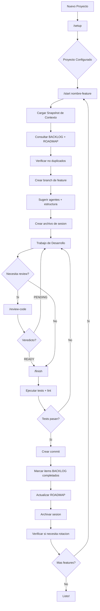
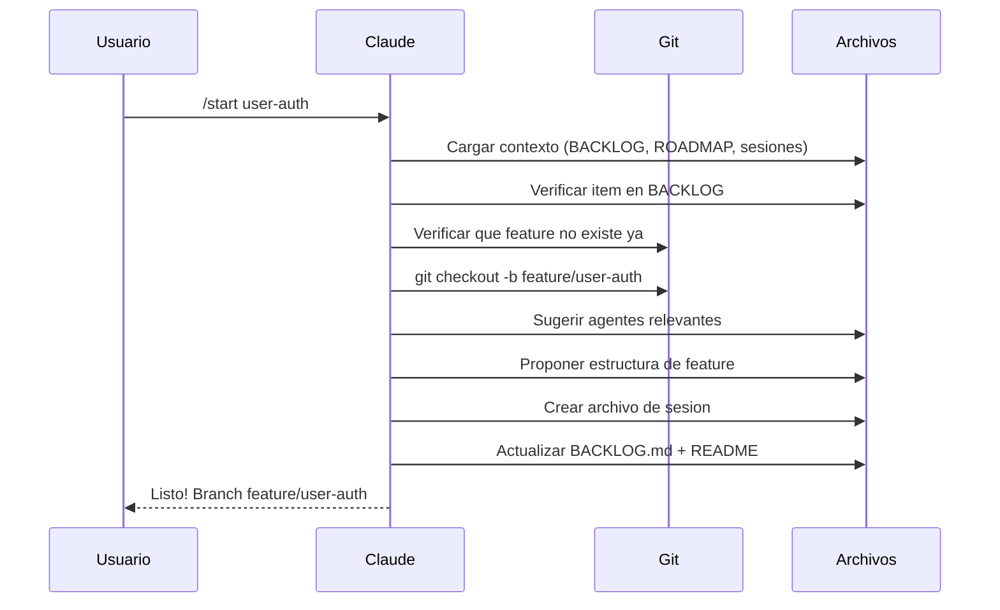
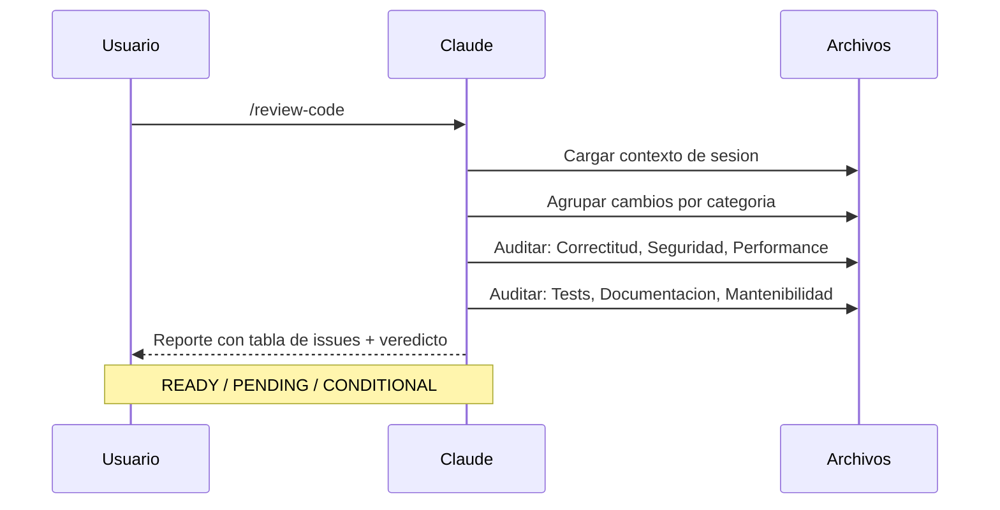
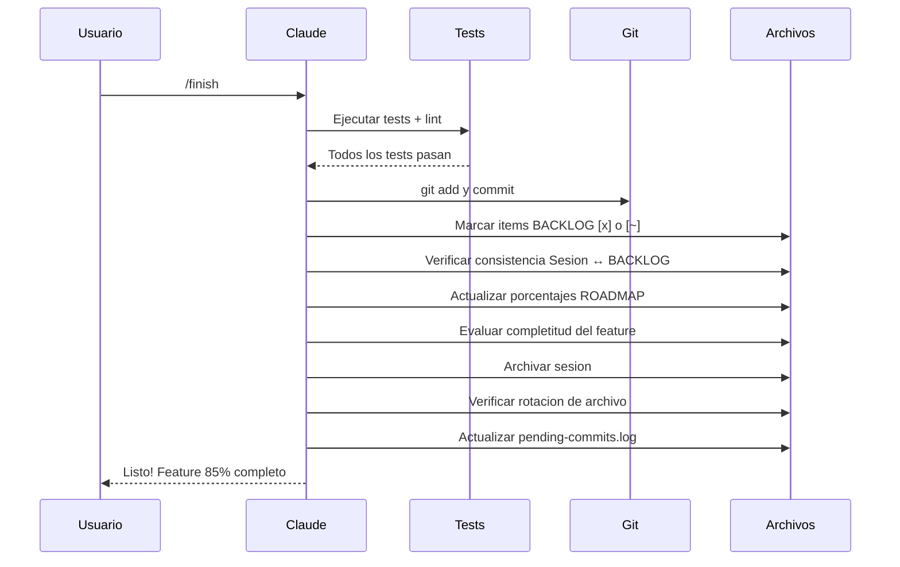
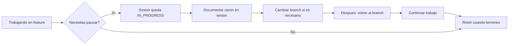
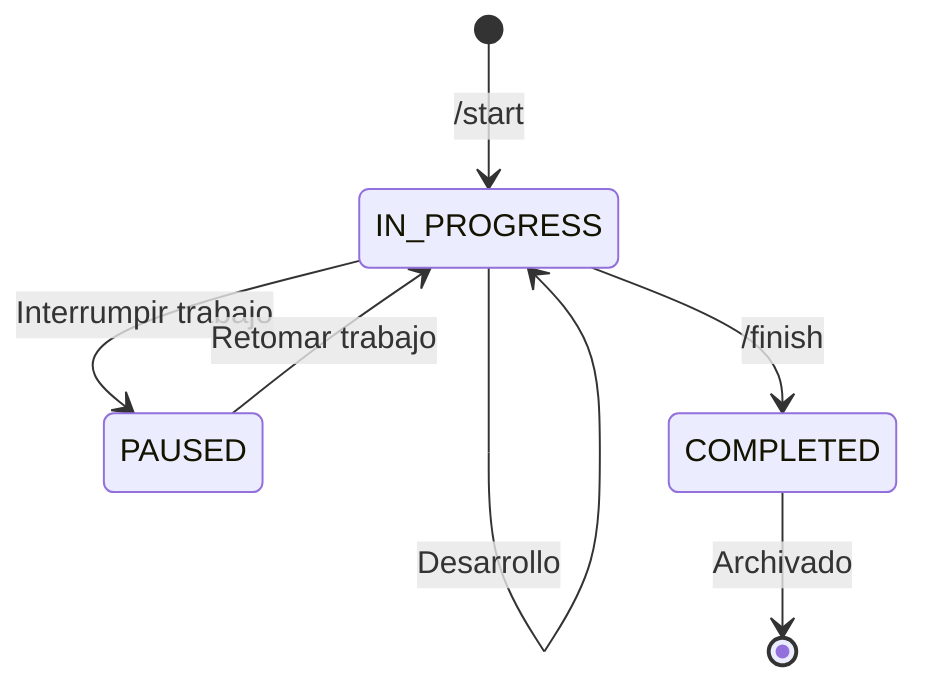

# workflowIA

[](https://claude.ai/claude-code)
[](https://opensource.org/licenses/MIT)

**[Read in English](README.md)**

Template de proyecto battle-tested para desarrollo asistido por IA con Claude Code. Proporciona seguimiento de sesiones, flujos de trabajo estructurados, 9 agentes especializados y trazabilidad completa del desarrollo. Nacido de 45+ sesiones reales de desarrollo.

## Características

- **Wizard de Configuración** (`/setup`) - Configura tu proyecto con preguntas guiadas
- **Seguimiento de Sesiones** - Documenta cada sesión de desarrollo automáticamente
- **Flujo Estructurado** - Inicia y finaliza features con `/start` y `/finish`
- **9 Agentes Especializados** - Context provider, feature architect, test engineer, y más
- **Code Review Multi-Categoría** - Auditorías estructuradas con veredictos READY/PENDING/CONDITIONAL
- **Tracking BACKLOG + ROADMAP** - Consistencia bidireccional entre sesiones e ítems del backlog
- **Post-Commit Hook** - Registro automático de commits en log de pendientes
- **Referencia de Arquitectura** - Patrones auto-cargados para consistencia estructural
- **Rotación de Archivos** - Limpieza automática de sesiones completadas e historial
- **Todo Configurable** - Package manager, comandos, convenciones git, idiomas, umbrales
- **Integración MCP** - Busca, explora e instala MCP servers
- **Soporte Bilingüe** - Preferencias de idioma para código y chat

## Inicio Rápido

### 1. Clonar o Usar Template

```bash
# Clonar el repositorio
git clone https://github.com/brujoh88/workflowIA.git mi-proyecto
cd mi-proyecto

# O usar el botón "Use this template" de GitHub
```

### 2. Inicializar Git (si es proyecto nuevo)

```bash
git init
```

### 3. Ejecutar Wizard de Configuración

Abre Claude Code y ejecuta:

```
/setup
```

Esto va a:
- Recopilar metadata del proyecto, stack y preferencias
- Configurar comandos y convenciones git
- Instalar el post-commit hook para tracking automático de commits
- Crear estructura de carpetas
- Sugerir MCP servers relevantes

### 4. Comienza a Desarrollar

```
/start mi-feature    # Crea branch + sesión + carga contexto + actualiza BACKLOG
... tu trabajo ...
/review-code         # Auditoría multi-categoría con veredicto
/finish              # Tests + commit + archiva + actualiza ROADMAP
```

---

## Diagrama de Flujo



---

## Escenarios Comunes

### Escenario 1: Iniciando un Nuevo Feature



### Escenario 2: Code Review



### Escenario 3: Finalizando un Feature



### Escenario 4: Pausando el Trabajo



---

## Estructura del Proyecto

```
.
├── .claude/
│   ├── project.config.json       # Configuracion + umbrales de workflow
│   ├── settings.local.json       # Permisos (no se commitea)
│   ├── MANUAL.md                 # Guia de usuario del framework
│   ├── skills/
│   │   ├── setup/                # Wizard de configuracion
│   │   ├── start/                # Iniciar feature (contexto + BACKLOG + agentes)
│   │   ├── finish/               # Finalizar feature (tests + tracking + rotacion)
│   │   ├── review-code/          # Auditoria multi-categoria
│   │   ├── architecture-ref/     # Patrones de arquitectura (auto-cargado)
│   │   ├── explore-code/         # Exploracion de codigo
│   │   ├── fix-issue/            # Flujo de correccion de bugs
│   │   ├── deploy/               # Flujo de deployment
│   │   └── mcp/                  # Gestion de MCP servers
│   ├── agents/                   # 9 agentes especializados
│   │   ├── session-tracker.md    # Gestion de ciclo de vida de sesiones
│   │   ├── context-provider.md   # Snapshot del proyecto (rapido/profundo)
│   │   ├── feature-architect.md  # Planificacion de estructura de features
│   │   ├── code-reviewer.md      # Auditoria estructurada con veredictos
│   │   ├── code-explorer.md      # Navegacion del codebase
│   │   ├── test-engineer.md      # Creacion de tests + cobertura
│   │   ├── db-analyst.md         # Diseno de base de datos + queries
│   │   ├── api-documenter.md     # Auditoria de documentacion de API
│   │   └── frontend-integrator.md # Scaffolding de componentes + a11y
│   └── rules/                    # Reglas por contexto
│       ├── api.md                # Convenciones de API
│       ├── database.md           # Convenciones de base de datos
│       └── frontend.md           # Convenciones de frontend
├── context/
│   ├── README.md                 # Indice de sesiones + reglas de rotacion
│   ├── BACKLOG.md                # Backlog con marcadores de completitud
│   ├── ROADMAP.md                # Seguimiento de progreso por modulo
│   ├── .pending-commits.log      # Commits auto-registrados (via hook)
│   ├── tmp/                      # Sesiones activas
│   ├── archive/
│   │   ├── COMPLETED.md          # Historial de items completados
│   │   └── YYYY-QN/
│   │       ├── sessions/         # Archivos de sesion archivados
│   │       └── SUMMARY.md        # Resumen trimestral
│   └── consolidated/             # Documentacion por feature completado
├── scripts/
│   └── hooks/
│       └── post-commit           # Auto-registra commits en log de pendientes
├── CLAUDE.md                     # Instrucciones del proyecto (routing + reglas + agentes)
└── CLAUDE.local.md               # Config local (no se commitea)
```

## Agentes

9 agentes especializados, cada uno con un rol específico:

| Agente | Rol | Invocado Por |
|--------|-----|--------------|
| **session-tracker** | Ciclo de vida de sesiones, tracking de commits, rotación | `/start`, `/finish` |
| **context-provider** | Snapshot del proyecto (rápido ~30s / profundo ~2min) | `/start` (auto), directo |
| **feature-architect** | Detectar patrones, proponer estructura de features | `/start` (features nuevos) |
| **code-reviewer** | Auditoría multi-categoría con READY/PENDING/CONDITIONAL | `/review-code` |
| **code-explorer** | Navegación y comprensión del codebase | `/explore-code` |
| **test-engineer** | Creación de tests con patrón AAA + cobertura | `/finish` (auto), directo |
| **db-analyst** | Diseño de base de datos, queries, migraciones | Delegación directa |
| **api-documenter** | Auditoría de completitud de documentación API | Delegación directa |
| **frontend-integrator** | Scaffolding de componentes + accesibilidad WCAG AA | Delegación directa |

## Comandos Disponibles

| Comando | Descripción |
|---------|-------------|
| `/setup` | Wizard interactivo de configuración (instala hooks) |
| `/start <feature>` | Iniciar feature con carga de contexto + check BACKLOG + sugerencia de agentes |
| `/finish` | Tests + commit + actualización BACKLOG/ROADMAP + archivado + rotación |
| `/review-code` | Auditoría multi-categoría: Correctitud, Seguridad, Performance, Tests, Docs, Mantenibilidad |
| `/explore-code` | Navegar y entender el codebase |
| `/fix-issue` | Flujo guiado de debugging |
| `/deploy` | Build, verificar y deploy |
| `/mcp search <término>` | Buscar MCP servers |
| `/mcp install <nombre>` | Instalar y configurar un MCP |
| `/mcp suggest` | Obtener sugerencias de MCP según tu stack |
| `/mcp list` | Listar MCPs instalados |

## Configuración

Toda la configuración se guarda en `.claude/project.config.json`:

```json
{
  "project": {
    "name": "mi-proyecto",
    "description": "Descripcion del proyecto",
    "stack": "Node.js + PostgreSQL"
  },
  "language": {
    "code": "en",
    "chat": "es"
  },
  "commands": {
    "packageManager": "npm",
    "test": "npm test",
    "lint": "npm run lint",
    "dev": "npm run dev",
    "build": "npm run build"
  },
  "git": {
    "branchPrefixes": {
      "feature": "feature/",
      "fix": "fix/",
      "hotfix": "hotfix/"
    },
    "mainBranch": "main"
  },
  "conventions": {
    "files": "kebab-case",
    "commits": "conventional"
  },
  "workflow": {
    "maxFileLines": 400,
    "maxFunctionLines": 50,
    "archiveRotationThreshold": 15,
    "blockRotationThreshold": 3,
    "preImplementationChecklist": true,
    "roadmapEnabled": true
  },
  "initialized": true
}
```

## Reglas Enforced

El framework enforce estas prácticas de desarrollo:

| Regla | Descripción |
|-------|-------------|
| **Protocolo de Debugging** | Formular 3 hipótesis antes de modificar código para corregir un bug |
| **No Acción Prematura** | Leer antes de escribir, entender antes de cambiar, preguntar antes de asumir |
| **Disciplina de Sesión** | Cada `/start` crea una sesión; cada `/finish` la cierra |
| **Límites de Tamaño** | ~400 líneas/archivo, ~50 líneas/función (configurable) |
| **Consistencia Bidireccional** | Sesión y BACKLOG deben estar sincronizados en `/finish` |

## Estados de Sesión



## Marcadores de BACKLOG

| Marcador | Significado |
|----------|-------------|
| `[ ]` | Pendiente - no iniciado |
| `[~]` | Parcialmente completado |
| `[x]` | Completamente terminado |

Los ítems completados incluyen referencia a la sesión: `*(session-20260206-1430-nombre-feature)*`

## MCP Servers

[Model Context Protocol (MCP)](https://modelcontextprotocol.io/) permite extender las capacidades de Claude conectándolo a herramientas y servicios externos.

Durante `/setup`, el wizard sugiere MCPs basándose en tu stack:

| Stack | MCP Sugerido |
|-------|--------------|
| PostgreSQL | `@modelcontextprotocol/server-postgres` |
| GitHub | `@modelcontextprotocol/server-github` |
| Docker | `mcp-server-docker` |
| Slack | `@modelcontextprotocol/server-slack` |

Los MCPs se configuran en `.claude/settings.local.json` (no se commitea a git).

## Personalización

### Agregar Skills Personalizados

Crea un nuevo skill en `.claude/skills/tu-skill/SKILL.md`:

```markdown
---
name: tu-skill
description: Qué hace este skill
allowed-tools: Bash, Read, Write, Edit
---

# Tu Skill

Instrucciones para que Claude siga...
```

### Agregar Agentes

Crea un nuevo agente en `.claude/agents/tu-agente.md`:

```markdown
# Agent: Nombre del Agente

## Responsibilities
- Qué hace este agente

## Rules
- Solo lectura / acceso de escritura
- Cuándo invocarlo
```

### Agregar Reglas

Crea reglas específicas por contexto en `.claude/rules/`:

```markdown
---
paths:
  - "src/tu-contexto/**"
---

# Nombre de la Regla

Guías para este contexto...
```

## Requisitos

- [Claude Code CLI](https://claude.ai/claude-code) instalado
- Git

## Contribuir

Las contribuciones son bienvenidas. No dudes en enviar un Pull Request.

## Licencia

Licencia MIT - ver [LICENSE](LICENSE) para más detalles.
