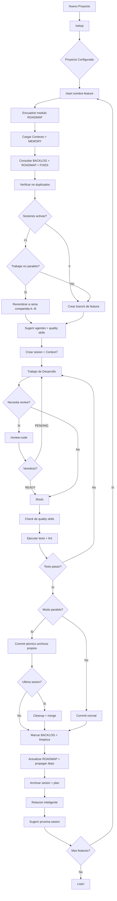

# workflowIA

[](https://claude.ai/claude-code)
[](https://opensource.org/licenses/MIT)

**[Read in English](README.md)**

Template de proyecto battle-tested para desarrollo asistido por IA con Claude Code. Proporciona seguimiento de sesiones, flujos de trabajo estructurados, 9 agentes especializados, 21 reglas enforced, soporte de sesiones paralelas y trazabilidad completa del desarrollo. Nacido de 124+ sesiones reales de desarrollo.

## Caracteristicas

- **Wizard de Configuracion** (`/setup`) - Configura tu proyecto con preguntas guiadas
- **Seguimiento de Sesiones** - Documenta cada sesion de desarrollo automaticamente
- **Flujo Estructurado** - Inicia y finaliza features con `/start` y `/finish`
- **9 Agentes Especializados** - Context provider, feature architect, test engineer, y mas
- **Code Review Multi-Categoria** - Auditorias estructuradas con veredictos READY/PENDING/CONDITIONAL
- **Auditoria del Sistema** (`/audit`) - Escaneo de salud con 8 modulos e integracion BACKLOG
- **Tracking BACKLOG + ROADMAP** - Consistencia bidireccional entre sesiones e items del backlog
- **Registro de FIXES** - Tracking centralizado de bugs con flujos rapido/complejo/batch
- **Sistema MEMORY** - Lecciones aprendidas persistentes entre sesiones
- **Planes de Implementacion** - Flujo estructurado de planes con archivado
- **21 Reglas Enforced** - Practicas de desarrollo probadas en produccion
- **Sesiones Paralelas** - Soporte de rama compartida para 2+ instancias de Claude trabajando simultaneamente
- **Post-Commit Hook** - Registro automatico de commits con proteccion anti-loop
- **Integracion Context7** - Documentacion actualizada de librerias durante desarrollo
- **Rotacion Inteligente** - Limpieza manteniendo sesiones recientes, comprimiendo antiguas
- **Skills de Calidad** - Chequeos de calidad externos configurables para frontend y mas
- **Todo Configurable** - Package manager, comandos, convenciones git, idiomas, umbrales
- **Integracion MCP** - Busca, explora e instala MCP servers
- **Soporte Bilingue** - Preferencias de idioma para codigo y chat

## Inicio Rapido

### 1. Clonar o Usar Template

```bash
# Clonar el repositorio
git clone https://github.com/brujoh88/workflowIA.git mi-proyecto
cd mi-proyecto

# O usar el boton "Use this template" de GitHub
```

### 2. Inicializar Git (si es proyecto nuevo)

```bash
git init
```

### 3. Ejecutar Wizard de Configuracion

Abre Claude Code y ejecuta:

```
/setup
```

Esto va a:
- Recopilar metadata del proyecto, stack y preferencias
- Configurar comandos, convenciones git y umbrales de calidad
- Instalar el post-commit hook para tracking automatico de commits
- Crear MEMORY.md para lecciones persistentes
- Configurar directorio de planes de implementacion
- Crear estructura de carpetas
- Sugerir MCP servers relevantes (incluyendo Context7)

### 4. Comienza a Desarrollar

```
/start mi-feature    # Encuadramiento de modulo + branch + sesion + Context7 + quality skills
... tu trabajo ...
/review-code         # Auditoria multi-categoria con integracion de skills de calidad
/audit               # Escaneo de salud del sistema (8 modulos)
/finish              # Check de calidad + tests + resumen compacto + limpieza BACKLOG + rotacion
```

---

## Diagrama de Flujo


```mermaid
flowchart TD
    A[Nuevo Proyecto] --> B["`/setup`"]
    B --> C{Proyecto Configurado}

    C --> D["`/start nombre-feature`"]
    D --> D0[Encuadrar modulo ROADMAP]
    D0 --> D1[Cargar Contexto + MEMORY]
    D1 --> D2[Consultar BACKLOG + ROADMAP + FIXES]
    D2 --> D3[Verificar no duplicados]
    D3 --> D4{Sesiones activas?}
    D4 -->|0| E1[Crear branch de feature]
    D4 -->|≥1| E2{Trabajar en paralelo?}
    E2 -->|Si| E3[Renombrar a rama compartida A--B]
    E2 -->|No| E1
    E3 --> F
    E1 --> F[Sugerir agentes + quality skills]
    F --> G[Crear sesion + Context7]
    G --> H[Trabajo de Desarrollo]

    H --> I{Necesita review?}
    I -->|Si| I2["`/review-code`"]
    I2 --> I3{Veredicto?}
    I3 -->|READY| J
    I3 -->|PENDING| H
    I -->|No| J["`/finish`"]

    J --> J0[Check de quality skills]
    J0 --> K[Ejecutar tests + lint]
    K --> L{Tests pasan?}
    L -->|No| H
    L -->|Si| M{Modo paralelo?}
    M -->|Si| M1[Commit atomico archivos propios]
    M -->|No| M2[Commit normal]
    M1 --> M3{Ultima sesion?}
    M3 -->|Si| M4[Cleanup + merge]
    M3 -->|No| N
    M4 --> N
    M2 --> N[Marcar BACKLOG + limpieza]
    N --> O[Actualizar ROADMAP + propagar deps]
    O --> P[Archivar sesion + plan]
    P --> Q[Rotacion inteligente]
    Q --> QS[Sugerir proxima sesion]
    QS --> R{Mas features?}
    R -->|Si| D
    R -->|No| S[Listo!]
```

---

## Estructura del Proyecto

```
.
├── .claude/
│   ├── project.config.json       # Toda la configuracion del proyecto
│   ├── settings.json             # Config de plugins de Claude Code
│   ├── settings.local.json       # Permisos (no se commitea)
│   ├── MANUAL.md                 # Guia de usuario del framework
│   ├── MEMORY.md                 # Lecciones aprendidas persistentes
│   ├── plan/                     # Planes de implementacion (gitignored)
│   │   └── completados/          # Planes archivados
│   ├── skills/
│   │   ├── setup/                # Wizard de configuracion (v2)
│   │   ├── start/                # Iniciar feature (modulo + Context7)
│   │   ├── finish/               # Finalizar feature (quality check + rotacion)
│   │   ├── review-code/          # Auditoria (frontend/E2E + quality skills)
│   │   ├── audit/                # Auditoria del sistema (8 modulos) [NUEVO]
│   │   ├── architecture-ref/     # Patrones de arquitectura (auto-cargado)
│   │   ├── development-protocol-ref/ # Protocolo de desarrollo [NUEVO]
│   │   ├── ui-design-system-ref/ # Referencia de diseno UI [NUEVO]
│   │   ├── explore-code/         # Exploracion de codigo
│   │   ├── fix-issue/            # Flujo de correccion de bugs
│   │   ├── deploy/               # Flujo de deployment
│   │   ├── metrics/              # Dashboard de metricas del proyecto
│   │   └── mcp/                  # Gestion de MCP servers
│   ├── agents/                   # 9 agentes especializados
│   │   ├── session-tracker.md    # Ciclo de vida + commits anti-loop
│   │   ├── context-provider.md   # Snapshot + caminos sugeridos
│   │   ├── feature-architect.md  # Estructura + anatomy docs
│   │   ├── code-reviewer.md      # Auditoria standalone
│   │   ├── code-explorer.md      # Navegacion del codebase
│   │   ├── test-engineer.md      # Tests + cobertura ANTES/DESPUES
│   │   ├── db-analyst.md         # Diseno de schemas + migraciones
│   │   ├── api-documenter.md     # Auditoria de documentacion API
│   │   └── frontend-integrator.md # Componentes + a11y + dark mode
│   └── rules/                    # Reglas por contexto
│       ├── api.md
│       ├── database.md
│       └── frontend.md
├── context/
│   ├── README.md                 # Indice de sesiones + reglas de rotacion
│   ├── BACKLOG.md                # Backlog (<300 lineas objetivo)
│   ├── ROADMAP.md                # Seguimiento de progreso por modulo
│   ├── FIXES.md                  # Registro de bugs/fixes [NUEVO]
│   ├── .pending-commits.log      # Commits auto-registrados (via hook)
│   ├── tmp/                      # Sesiones activas + snapshot actual
│   ├── archive/
│   │   ├── COMPLETED.md          # Historial de items completados
│   │   └── YYYY-QN/
│   │       ├── sessions/         # Archivos de sesion archivados
│   │       └── SUMMARY.md        # Resumen trimestral
│   ├── auditorias/               # Reportes de auditoria [NUEVO]
│   └── consolidated/             # Documentacion por feature completado
├── scripts/
│   ├── context-lock.sh           # Lock distribuido para sesiones paralelas
│   └── hooks/
│       ├── pre-commit            # Lint, tamano archivos (R4), errores TypeScript (R16)
│       └── post-commit           # Auto-registra commits (con anti-loop)
├── CLAUDE.md                     # Instrucciones del proyecto (21 reglas + routing)
└── CLAUDE.local.md               # Config local (no se commitea)
```

## Agentes

9 agentes especializados, cada uno con un rol especifico:

| Agente | Rol | Invocado Por |
|--------|-----|--------------|
| **session-tracker** | Ciclo de vida, commits anti-loop, rotacion | `/start`, `/finish` |
| **context-provider** | Snapshot, caminos sugeridos, MEMORY | `/start` (auto), directo |
| **feature-architect** | Estructura, anatomy docs, limites de tamano | `/start` (features nuevos) |
| **code-reviewer** | Auditoria standalone multi-categoria | `/review-code` |
| **code-explorer** | Navegacion y comprension del codebase | `/explore-code` |
| **test-engineer** | Tests con protocolo cobertura ANTES/DESPUES | `/finish` (auto), directo |
| **db-analyst** | Diseno de schemas, migraciones, queries, indices | Delegacion directa |
| **api-documenter** | Auditoria de completitud de documentacion API | Delegacion directa |
| **frontend-integrator** | Componentes + WCAG AA + dark mode | Delegacion directa |

## Comandos Disponibles

| Comando | Descripcion |
|---------|-------------|
| `/setup` | Wizard de configuracion (v2: MEMORY, planes, hooks, calidad) |
| `/start <feature>` | Encuadramiento de modulo + branch + sesion + Context7 + quality skills |
| `/finish` | Check de calidad + tests + resumen compacto + limpieza BACKLOG + rotacion |
| `/review-code` | Auditoria multi-categoria + frontend/E2E + integracion quality skills |
| `/audit [modulo]` | Auditoria del sistema: Types, Security, Validation, Size, Coverage, Docs, Arch, Quality |
| `/explore-code` | Navegar y entender el codebase |
| `/fix-issue` | Flujo guiado de debugging (3 hipotesis) |
| `/deploy` | Build, verificar y deploy |
| `/metrics` | Dashboard de metricas y salud del proyecto (solo lectura) |
| `/mcp` | Buscar, instalar, configurar MCP servers |

## Configuracion

Toda la configuracion se guarda en `.claude/project.config.json`:

```json
{
  "project": { "name": "mi-proyecto", "description": "...", "stack": "..." },
  "language": { "code": "en", "chat": "es" },
  "commands": {
    "packageManager": "npm", "test": "npm test", "lint": "npm run lint",
    "dev": "npm run dev", "build": "npm run build", "syncTypes": ""
  },
  "git": {
    "branchPrefixes": { "feature": "feature/", "fix": "fix/", "hotfix": "hotfix/" },
    "mainBranch": "main", "devBranch": "", "coAuthoredBy": false
  },
  "conventions": { "files": "kebab-case", "commits": "conventional" },
  "workflow": {
    "maxFileLines": 400, "maxFunctionLines": 50,
    "archiveRotationThreshold": 15, "blockRotationThreshold": 3,
    "preImplementationChecklist": true, "roadmapEnabled": true,
    "backlogMaxLines": 300, "recentSessionsToKeep": 3, "coverageThreshold": 80
  },
  "quality": { "externalSkills": [] },
  "parallel": {
    "enabled": true, "lockTimeoutSeconds": 60,
    "lockFile": "context/.context.lock",
    "sharedBranch": { "enabled": true, "directory": "context/.parallel", "atomicCommits": true }
  },
  "initialized": true
}
```

## Reglas Enforced (21)

| # | Regla | Descripcion |
|---|-------|-------------|
| R1 | Idioma | Responder/codear en idioma configurado |
| R2 | Git Flow | main protegida, soporte branch dev |
| R3 | Commits | Co-Authored-By configurable |
| R4 | Tamano archivos | Enforce max lineas por tipo desde config |
| R5 | Testing | Cobertura ANTES/DESPUES, umbral objetivo |
| R6 | Verificar primero | Glob+Grep antes de crear |
| R7 | Compactacion BACKLOG | Mantener bajo max lineas |
| R8 | Delegacion | Delegacion obligatoria a agentes/skills |
| R9 | Planes | Flujo estructurado de planes |
| R10 | Flujo de Fixes | Patrones rapido/complejo/batch |
| R11 | No Accion Prematura | Leer, entender, preguntar |
| R12 | Protocolo Debugging | 3 hipotesis antes de corregir |
| R13 | Disciplina Sesion | Start crea, finish cierra |
| R14 | Cero Inferencia | Solo fuentes concretas |
| R15 | Quality Skills | Chequeos de calidad frontend |
| R16 | Diagnosticos LSP | Errores de tipo son bloqueantes |
| R17 | Sync MANUAL | Mantener docs actualizados |
| R18 | Entorno Docker | Comandos DB dentro del container |
| R19 | Limite CPU | Workers de tests limitados |
| R20 | Protocolo Migraciones | Generar diff, revisar, deploy |
| R21 | Sesiones Paralelas | Rama compartida, commits atomicos, context lock |

## Requisitos

- [Claude Code CLI](https://claude.ai/claude-code) instalado
- Git

## Contribuir

Las contribuciones son bienvenidas. No dudes en enviar un Pull Request.

## Licencia

Licencia MIT - ver [LICENSE](LICENSE) para mas detalles.
