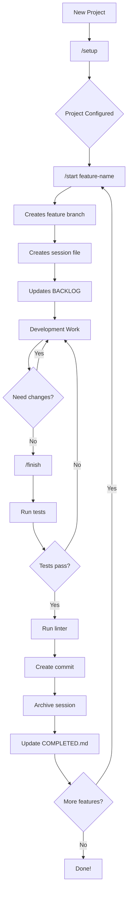
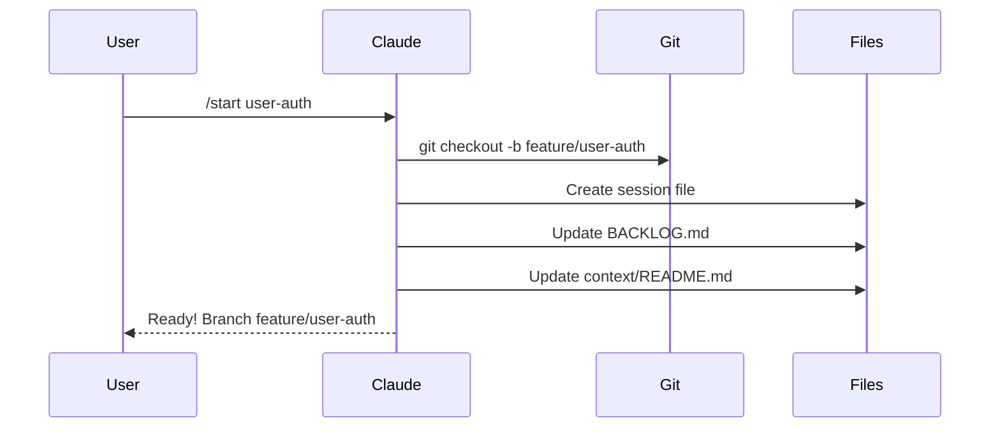
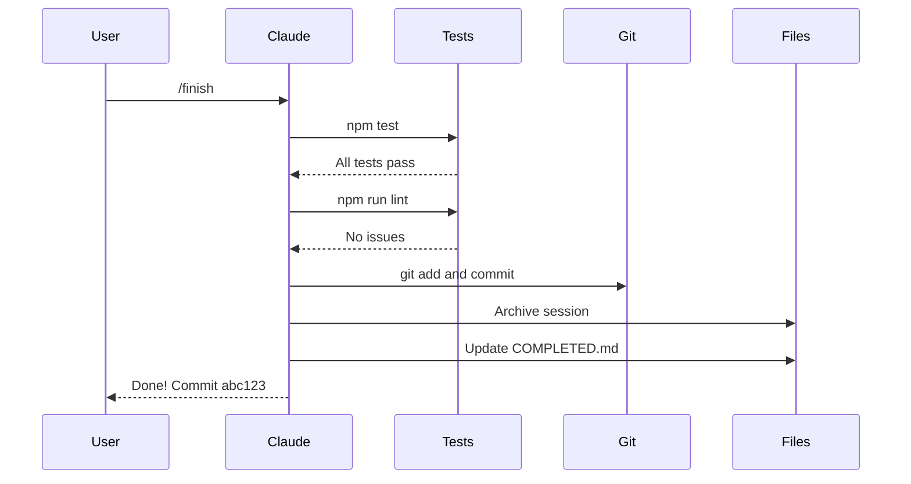
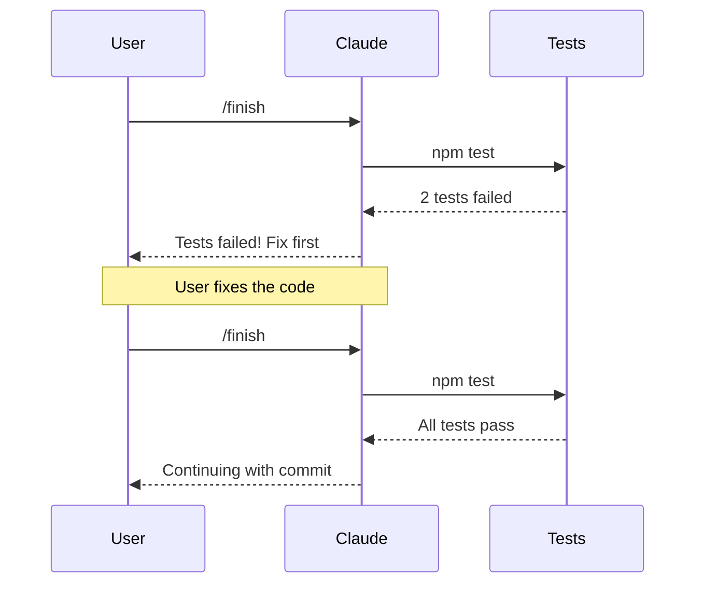
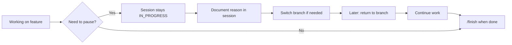
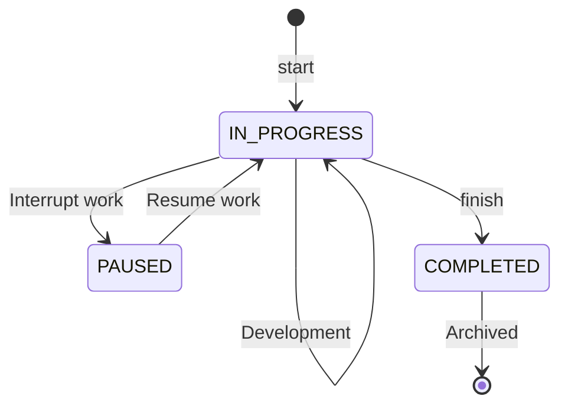

# workflowIA

[](https://claude.ai/claude-code)
[](https://opensource.org/licenses/MIT)

**[Leer en Español](README.es.md)**

A configurable project template for AI-assisted development with Claude Code. Provides session tracking, structured workflows, and development traceability out of the box.

## Features

- **Interactive Setup Wizard** (`/setup`) - Configure your project with guided prompts
- **Session Tracking** - Document every development session automatically
- **Structured Workflow** - Start and finish features with `/start` and `/finish`
- **Configurable Everything** - Package manager, commands, git conventions, languages
- **MCP Integration** - Search, explore and install MCP servers
- **Bilingual Support** - Code and chat language preferences

## Quick Start

### 1. Clone or Use Template

```bash
# Clone the repository
git clone https://github.com/brujoh88/workflowIA.git my-project
cd my-project

# Or use GitHub's "Use this template" button
```

### 2. Initialize Git (if new project)

```bash
git init
```

### 3. Run Setup Wizard

Open Claude Code and run:

```
/setup
```

### 4. Start Developing

```
/start my-feature    # Creates branch + session tracking
... your work ...
/finish              # Runs tests + commits + archives session
```

---

## Workflow Diagram



---

## Common Scenarios

### Scenario 1: Starting a New Feature



### Scenario 2: Finishing a Feature Successfully



### Scenario 3: Tests Fail



### Scenario 4: Pausing Work



---

## Project Structure

```
.
├── .claude/
│   ├── project.config.json    # Project configuration
│   ├── skills/
│   │   ├── setup/             # Setup wizard
│   │   ├── start/             # Start feature workflow
│   │   ├── finish/            # Finish feature workflow
│   │   └── mcp/               # MCP server management
│   ├── agents/                # Specialized agents
│   └── rules/                 # Context-specific rules
├── context/
│   ├── README.md              # Session index
│   ├── BACKLOG.md             # Task backlog
│   ├── tmp/                   # Active sessions
│   └── archive/               # Archived sessions
├── CLAUDE.md                  # Project instructions for Claude
└── CLAUDE.local.md            # Local config (gitignored)
```

## Configuration

All configuration is stored in `.claude/project.config.json`:

```json
{
  "project": {
    "name": "my-project",
    "description": "Project description",
    "stack": "Node.js + PostgreSQL"
  },
  "language": {
    "code": "en",
    "chat": "es"
  },
  "commands": {
    "packageManager": "npm",
    "test": "npm test",
    "lint": "npm run lint",
    "dev": "npm run dev",
    "build": "npm run build"
  },
  "git": {
    "branchPrefixes": {
      "feature": "feature/",
      "fix": "fix/",
      "hotfix": "hotfix/"
    },
    "mainBranch": "main"
  },
  "conventions": {
    "files": "kebab-case",
    "classes": "PascalCase",
    "functions": "camelCase",
    "constants": "UPPER_SNAKE_CASE",
    "commits": "conventional"
  },
  "structure": {
    "src": "src/",
    "tests": "tests/",
    "docs": "docs/"
  },
  "mcp": {
    "installed": [],
    "suggested": []
  },
  "initialized": true
}
```

## Available Commands

| Command | Description |
|---------|-------------|
| `/setup` | Interactive configuration wizard |
| `/start <feature>` | Start a new feature with branch and session |
| `/finish` | Run tests, commit, and archive session |
| `/mcp search <term>` | Search for MCP servers |
| `/mcp info <name>` | Get detailed info about an MCP |
| `/mcp install <name>` | Install and configure an MCP |
| `/mcp suggest` | Get MCP suggestions based on your stack |
| `/mcp list` | List installed MCPs |

## Session States



| State | Description |
|-------|-------------|
| `IN_PROGRESS` | Active development work |
| `PAUSED` | Work interrupted (document reason) |
| `COMPLETED` | Finished and archived |

## MCP Servers

[Model Context Protocol (MCP)](https://modelcontextprotocol.io/) servers extend Claude's capabilities by connecting to external tools and services.

### Suggested MCPs

During `/setup`, the wizard suggests MCPs based on your stack:

| Stack | Suggested MCP |
|-------|---------------|
| PostgreSQL | `@modelcontextprotocol/server-postgres` |
| GitHub | `@modelcontextprotocol/server-github` |
| Docker | `mcp-server-docker` |
| Slack | `@modelcontextprotocol/server-slack` |

### Managing MCPs

```bash
# Search for MCPs
/mcp search database

# Get info about a specific MCP
/mcp info @modelcontextprotocol/server-postgres

# Install an MCP
/mcp install @modelcontextprotocol/server-github

# See suggestions for your project
/mcp suggest

# List installed MCPs
/mcp list
```

MCPs are configured in `.claude/settings.local.json` (not committed to git).

## Customization

### Adding Custom Skills

Create a new skill in `.claude/skills/your-skill/SKILL.md`:

```markdown
---
name: your-skill
description: What this skill does
allowed-tools: Bash, Read, Write, Edit
---

# Your Skill

Instructions for Claude to follow...
```

### Adding Rules

Create context-specific rules in `.claude/rules/`:

```markdown
# Rule Name

When working on [context], follow these guidelines:
- Guideline 1
- Guideline 2
```

## Requirements

- [Claude Code CLI](https://claude.ai/claude-code) installed
- Git

## Contributing

Contributions are welcome! Please feel free to submit a Pull Request.

## License

MIT License - see [LICENSE](LICENSE) for details.
