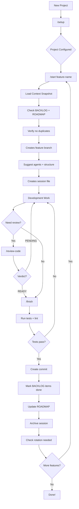
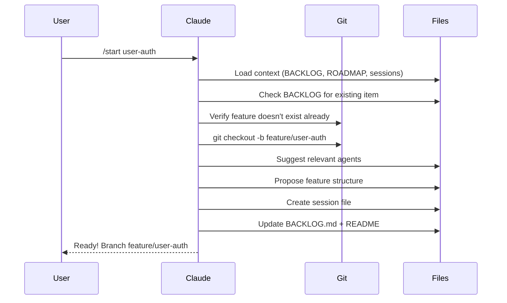
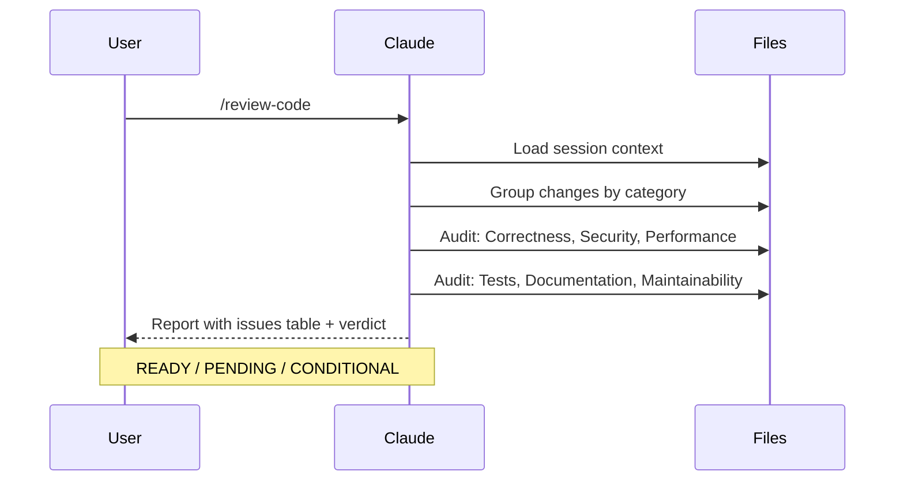
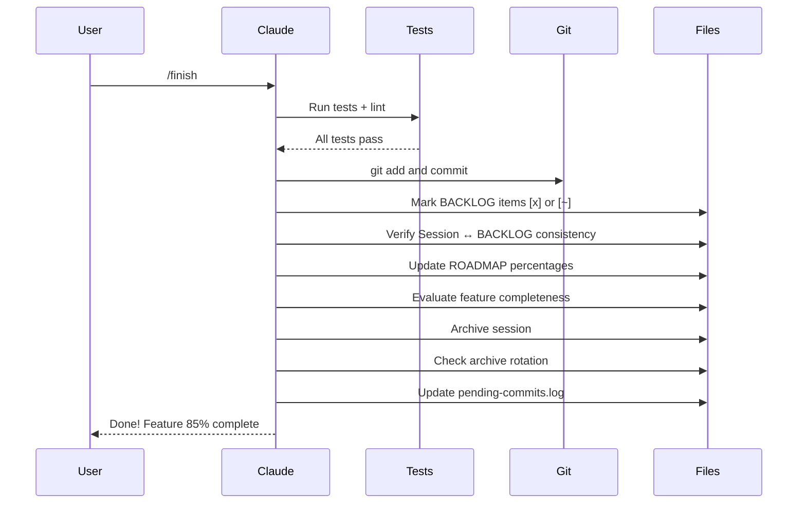
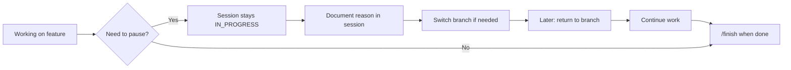

# workflowIA

[](https://claude.ai/claude-code)
[](https://opensource.org/licenses/MIT)

**[Leer en Español](README.es.md)**

A battle-tested project template for AI-assisted development with Claude Code. Provides session tracking, structured workflows, 9 specialized agents, and full development traceability out of the box. Born from 45+ real development sessions.

## Features

- **Interactive Setup Wizard** (`/setup`) - Configure your project with guided prompts
- **Session Tracking** - Document every development session automatically
- **Structured Workflow** - Start and finish features with `/start` and `/finish`
- **9 Specialized Agents** - Context provider, feature architect, test engineer, and more
- **Multi-Category Code Review** - Structured audits with READY/PENDING/CONDITIONAL verdicts
- **BACKLOG + ROADMAP Tracking** - Bidirectional consistency between sessions and backlog items
- **Post-Commit Hook** - Automatic commit registration in pending log
- **Architecture Reference** - Auto-loaded patterns for structural consistency
- **Archive Rotation** - Automatic cleanup of completed sessions and history
- **Configurable Everything** - Package manager, commands, git conventions, languages, thresholds
- **MCP Integration** - Search, explore and install MCP servers
- **Bilingual Support** - Code and chat language preferences

## Quick Start

### 1. Clone or Use Template

```bash
# Clone the repository
git clone https://github.com/brujoh88/workflowIA.git my-project
cd my-project

# Or use GitHub's "Use this template" button
```

### 2. Initialize Git (if new project)

```bash
git init
```

### 3. Run Setup Wizard

Open Claude Code and run:

```
/setup
```

This will:
- Collect project metadata, stack, and preferences
- Configure commands and git conventions
- Install the post-commit hook for automatic commit tracking
- Create folder structure
- Suggest relevant MCP servers

### 4. Start Developing

```
/start my-feature    # Creates branch + session + loads context + updates BACKLOG
... your work ...
/review-code         # Multi-category code audit with verdict
/finish              # Runs tests + commits + archives + updates ROADMAP
```

---

## Workflow Diagram



---

## Common Scenarios

### Scenario 1: Starting a New Feature



### Scenario 2: Code Review



### Scenario 3: Finishing a Feature



### Scenario 4: Pausing Work



---

## Project Structure

```
.
├── .claude/
│   ├── project.config.json       # Project configuration + workflow thresholds
│   ├── settings.local.json       # Permissions (gitignored)
│   ├── MANUAL.md                 # User guide for the framework
│   ├── skills/
│   │   ├── setup/                # Setup wizard
│   │   ├── start/                # Start feature (context + BACKLOG + agents)
│   │   ├── finish/               # Finish feature (tests + tracking + rotation)
│   │   ├── review-code/          # Multi-category code audit
│   │   ├── architecture-ref/     # Architecture patterns (auto-loaded)
│   │   ├── explore-code/         # Code exploration
│   │   ├── fix-issue/            # Bug fix workflow
│   │   ├── deploy/               # Deployment workflow
│   │   └── mcp/                  # MCP server management
│   ├── agents/                   # 9 specialized agents
│   │   ├── session-tracker.md    # Session lifecycle management
│   │   ├── context-provider.md   # Project snapshot (quick/deep)
│   │   ├── feature-architect.md  # Feature structure planning
│   │   ├── code-reviewer.md      # Structured audit with verdicts
│   │   ├── code-explorer.md      # Codebase navigation
│   │   ├── test-engineer.md      # Test creation + coverage
│   │   ├── db-analyst.md         # Database design + queries
│   │   ├── api-documenter.md     # API documentation audit
│   │   └── frontend-integrator.md # Component scaffolding + a11y
│   └── rules/                    # Context-specific rules
│       ├── api.md                # API conventions
│       ├── database.md           # Database conventions
│       └── frontend.md           # Frontend conventions
├── context/
│   ├── README.md                 # Session index + rotation rules
│   ├── BACKLOG.md                # Task backlog with completion markers
│   ├── ROADMAP.md                # Module progress tracking
│   ├── .pending-commits.log      # Auto-registered commits (via hook)
│   ├── tmp/                      # Active sessions
│   ├── archive/
│   │   ├── COMPLETED.md          # History of completed items
│   │   └── YYYY-QN/
│   │       ├── sessions/         # Archived session files
│   │       └── SUMMARY.md        # Quarterly summary
│   └── consolidated/             # Per-feature documentation
├── scripts/
│   └── hooks/
│       └── post-commit           # Auto-registers commits in pending log
├── CLAUDE.md                     # Project instructions (routing + rules + agents)
└── CLAUDE.local.md               # Local config (gitignored)
```

## Agents

9 specialized agents, each with a focused role:

| Agent | Role | Invoked By |
|-------|------|------------|
| **session-tracker** | Session lifecycle, commit tracking, rotation | `/start`, `/finish` |
| **context-provider** | Project snapshot (quick ~30s / deep ~2min) | `/start` (auto), direct |
| **feature-architect** | Detect patterns, propose feature structure | `/start` (new features) |
| **code-reviewer** | Multi-category audit with READY/PENDING/CONDITIONAL | `/review-code` |
| **code-explorer** | Codebase navigation and understanding | `/explore-code` |
| **test-engineer** | Test creation following AAA pattern + coverage | `/finish` (auto), direct |
| **db-analyst** | Database design, queries, migrations | Direct delegation |
| **api-documenter** | API documentation completeness audit | Direct delegation |
| **frontend-integrator** | Component scaffolding + WCAG AA accessibility | Direct delegation |

## Available Commands

| Command | Description |
|---------|-------------|
| `/setup` | Interactive configuration wizard (installs hooks) |
| `/start <feature>` | Start feature with context loading + BACKLOG check + agent suggestion |
| `/finish` | Tests + commit + BACKLOG/ROADMAP update + archive + rotation |
| `/review-code` | Multi-category audit: Correctness, Security, Performance, Tests, Docs, Maintainability |
| `/explore-code` | Navigate and understand codebase |
| `/fix-issue` | Guided debugging workflow |
| `/deploy` | Build, verify, and deploy |
| `/mcp search <term>` | Search for MCP servers |
| `/mcp install <name>` | Install and configure an MCP |
| `/mcp suggest` | Get MCP suggestions based on your stack |
| `/mcp list` | List installed MCPs |

## Configuration

All configuration is stored in `.claude/project.config.json`:

```json
{
  "project": {
    "name": "my-project",
    "description": "Project description",
    "stack": "Node.js + PostgreSQL"
  },
  "language": {
    "code": "en",
    "chat": "es"
  },
  "commands": {
    "packageManager": "npm",
    "test": "npm test",
    "lint": "npm run lint",
    "dev": "npm run dev",
    "build": "npm run build"
  },
  "git": {
    "branchPrefixes": {
      "feature": "feature/",
      "fix": "fix/",
      "hotfix": "hotfix/"
    },
    "mainBranch": "main"
  },
  "conventions": {
    "files": "kebab-case",
    "commits": "conventional"
  },
  "workflow": {
    "maxFileLines": 400,
    "maxFunctionLines": 50,
    "archiveRotationThreshold": 15,
    "blockRotationThreshold": 3,
    "preImplementationChecklist": true,
    "roadmapEnabled": true
  },
  "initialized": true
}
```

## Enforced Rules

The framework enforces these development practices:

| Rule | Description |
|------|-------------|
| **Debugging Protocol** | Formulate 3 hypotheses before modifying code to fix a bug |
| **No Premature Action** | Read before writing, understand before changing, ask before assuming |
| **Session Discipline** | Every `/start` creates a session; every `/finish` closes it |
| **Code Size Limits** | ~400 lines/file, ~50 lines/function (configurable) |
| **Bidirectional Consistency** | Session and BACKLOG must be in sync on `/finish` |

## Session States


## BACKLOG Markers

| Marker | Meaning |
|--------|---------|
| `[ ]` | Pending - not started |
| `[~]` | Partially completed |
| `[x]` | Fully completed |

Completed items include session references: `*(session-20260206-1430-feature-name)*`

## MCP Servers

[Model Context Protocol (MCP)](https://modelcontextprotocol.io/) servers extend Claude's capabilities by connecting to external tools and services.

During `/setup`, the wizard suggests MCPs based on your stack:

| Stack | Suggested MCP |
|-------|---------------|
| PostgreSQL | `@modelcontextprotocol/server-postgres` |
| GitHub | `@modelcontextprotocol/server-github` |
| Docker | `mcp-server-docker` |
| Slack | `@modelcontextprotocol/server-slack` |

MCPs are configured in `.claude/settings.local.json` (not committed to git).

## Customization

### Adding Custom Skills

Create a new skill in `.claude/skills/your-skill/SKILL.md`:

```markdown
---
name: your-skill
description: What this skill does
allowed-tools: Bash, Read, Write, Edit
---

# Your Skill

Instructions for Claude to follow...
```

### Adding Agents

Create a new agent in `.claude/agents/your-agent.md`:

```markdown
# Agent: Your Agent Name

## Responsibilities
- What this agent does

## Rules
- Read-only / write access
- When to invoke
```

### Adding Rules

Create context-specific rules in `.claude/rules/`:

```markdown
---
paths:
  - "src/your-context/**"
---

# Rule Name

Guidelines for this context...
```

## Requirements

- [Claude Code CLI](https://claude.ai/claude-code) installed
- Git

## Contributing

Contributions are welcome! Please feel free to submit a Pull Request.

## License

MIT License - see [LICENSE](LICENSE) for details.
