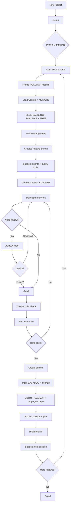

# workflowIA

[](https://claude.ai/claude-code)
[](https://opensource.org/licenses/MIT)

**[Leer en Español](README.es.md)**

A battle-tested project template for AI-assisted development with Claude Code. Provides session tracking, structured workflows, 9 specialized agents, 17 enforced rules, and full development traceability out of the box. Born from 124+ real development sessions.

## Features

- **Interactive Setup Wizard** (`/setup`) - Configure your project with guided prompts
- **Session Tracking** - Document every development session automatically
- **Structured Workflow** - Start and finish features with `/start` and `/finish`
- **9 Specialized Agents** - Context provider, feature architect, test engineer, and more
- **Multi-Category Code Review** - Structured audits with READY/PENDING/CONDITIONAL verdicts
- **System-Wide Audit** (`/audit`) - 8-module code health scan with BACKLOG integration
- **BACKLOG + ROADMAP Tracking** - Bidirectional consistency between sessions and backlog items
- **FIXES Registry** - Centralized bug tracking with quick/complex/batch workflows
- **MEMORY System** - Persistent lessons learned across sessions
- **Implementation Plans** - Structured plan workflow with archiving
- **17 Enforced Rules** - Battle-tested development practices
- **Post-Commit Hook** - Automatic commit registration with anti-loop protection
- **Context7 Integration** - Up-to-date library documentation during development
- **Archive Rotation** - Smart cleanup keeping recent sessions, compressing old ones
- **Quality Skills** - Configurable external quality checks for frontend and more
- **Configurable Everything** - Package manager, commands, git conventions, languages, thresholds
- **MCP Integration** - Search, explore and install MCP servers
- **Bilingual Support** - Code and chat language preferences

## Quick Start

### 1. Clone or Use Template

```bash
# Clone the repository
git clone https://github.com/brujoh88/workflowIA.git my-project
cd my-project

# Or use GitHub's "Use this template" button
```

### 2. Initialize Git (if new project)

```bash
git init
```

### 3. Run Setup Wizard

Open Claude Code and run:

```
/setup
```

This will:
- Collect project metadata, stack, and preferences
- Configure commands, git conventions, and quality thresholds
- Install the post-commit hook for automatic commit tracking
- Create MEMORY.md for persistent lessons
- Set up implementation plans directory
- Create folder structure
- Suggest relevant MCP servers (including Context7)

### 4. Start Developing

```
/start my-feature    # Module framing + branch + session + Context7 + quality skills
... your work ...
/review-code         # Multi-category audit with quality skill integration
/audit               # System-wide health scan (8 modules)
/finish              # Quality check + tests + compact summary + BACKLOG cleanup + rotation
```

---

## Workflow Diagram


```mermaid
flowchart TD
    A[New Project] --> B["`/setup`"]
    B --> C{Project Configured}

    C --> D["`/start feature-name`"]
    D --> D0[Frame ROADMAP module]
    D0 --> D1[Load Context + MEMORY]
    D1 --> D2[Check BACKLOG + ROADMAP + FIXES]
    D2 --> D3[Verify no duplicates]
    D3 --> E[Creates feature branch]
    E --> F[Suggest agents + quality skills]
    F --> G[Creates session + Context7]
    G --> H[Development Work]

    H --> I{Need review?}
    I -->|Yes| I2["`/review-code`"]
    I2 --> I3{Verdict?}
    I3 -->|READY| J
    I3 -->|PENDING| H
    I -->|No| J["`/finish`"]

    J --> J0[Quality skills check]
    J0 --> K[Run tests + lint]
    K --> L{Tests pass?}
    L -->|No| H
    L -->|Yes| M[Create commit]
    M --> N[Mark BACKLOG + cleanup]
    N --> O[Update ROADMAP + propagate deps]
    O --> P[Archive session + plan]
    P --> Q[Smart rotation]
    Q --> QS[Suggest next session]
    QS --> R{More features?}
    R -->|Yes| D
    R -->|No| S[Done!]
```

---

## Project Structure

```
.
├── .claude/
│   ├── project.config.json       # All project settings
│   ├── settings.json             # Claude Code plugin settings
│   ├── settings.local.json       # Permissions (gitignored)
│   ├── MANUAL.md                 # User guide for the framework
│   ├── MEMORY.md                 # Persistent lessons learned
│   ├── plan/                     # Implementation plans (gitignored)
│   │   └── completados/          # Archived plans
│   ├── skills/
│   │   ├── setup/                # Setup wizard (v2)
│   │   ├── start/                # Start feature (module framing + Context7)
│   │   ├── finish/               # Finish feature (quality check + smart rotation)
│   │   ├── review-code/          # Code audit (frontend/E2E + quality skills)
│   │   ├── audit/                # System-wide audit (8 modules) [NEW]
│   │   ├── architecture-ref/     # Architecture patterns (auto-loaded)
│   │   ├── development-protocol-ref/ # Dev protocol reference [NEW]
│   │   ├── ui-design-system-ref/ # UI design reference [NEW]
│   │   ├── explore-code/         # Code exploration
│   │   ├── fix-issue/            # Bug fix workflow
│   │   ├── deploy/               # Deployment workflow
│   │   └── mcp/                  # MCP server management
│   ├── agents/                   # 9 specialized agents
│   │   ├── session-tracker.md    # Session lifecycle + anti-loop commits
│   │   ├── context-provider.md   # Project snapshot + suggested paths
│   │   ├── feature-architect.md  # Feature structure + anatomy docs
│   │   ├── code-reviewer.md      # Standalone structured audit
│   │   ├── code-explorer.md      # Codebase navigation
│   │   ├── test-engineer.md      # Tests + coverage BEFORE/AFTER
│   │   ├── db-analyst.md         # Schema design + migrations
│   │   ├── api-documenter.md     # API documentation audit
│   │   └── frontend-integrator.md # Components + a11y + dark mode
│   └── rules/                    # Context-specific rules
│       ├── api.md
│       ├── database.md
│       └── frontend.md
├── context/
│   ├── README.md                 # Session index + rotation rules
│   ├── BACKLOG.md                # Task backlog (<300 lines target)
│   ├── ROADMAP.md                # Module progress tracking
│   ├── FIXES.md                  # Bug/fix registry [NEW]
│   ├── .pending-commits.log      # Auto-registered commits (via hook)
│   ├── tmp/                      # Active sessions + current snapshot
│   ├── archive/
│   │   ├── COMPLETED.md          # History of completed items
│   │   └── YYYY-QN/
│   │       ├── sessions/         # Archived session files
│   │       └── SUMMARY.md        # Quarterly summary
│   ├── auditorias/               # Audit reports [NEW]
│   └── consolidated/             # Per-feature documentation
├── scripts/
│   └── hooks/
│       └── post-commit           # Auto-registers commits (with anti-loop)
├── CLAUDE.md                     # Project instructions (17 rules + routing)
└── CLAUDE.local.md               # Local config (gitignored)
```

## Agents

9 specialized agents, each with a focused role:

| Agent | Role | Invoked By |
|-------|------|------------|
| **session-tracker** | Session lifecycle, anti-loop commits, rotation | `/start`, `/finish` |
| **context-provider** | Project snapshot, suggested paths, MEMORY | `/start` (auto), direct |
| **feature-architect** | Feature structure, anatomy docs, size limits | `/start` (new features) |
| **code-reviewer** | Standalone multi-category audit with verdicts | `/review-code` |
| **code-explorer** | Codebase navigation and understanding | `/explore-code` |
| **test-engineer** | Tests with coverage BEFORE/AFTER protocol | `/finish` (auto), direct |
| **db-analyst** | Schema design, migrations, queries, indexes | Direct delegation |
| **api-documenter** | API documentation completeness audit | Direct delegation |
| **frontend-integrator** | Components + WCAG AA + dark mode | Direct delegation |

## Available Commands

| Command | Description |
|---------|-------------|
| `/setup` | Interactive configuration wizard (v2: MEMORY, plans, hooks, quality) |
| `/start <feature>` | Module framing + branch + session + Context7 + quality skills |
| `/finish` | Quality check + tests + compact summary + BACKLOG cleanup + rotation |
| `/review-code` | Multi-category audit + frontend/E2E + quality skill integration |
| `/audit [module]` | System-wide audit: Types, Security, Validation, Size, Coverage, Docs, Arch, Quality |
| `/explore-code` | Navigate and understand codebase |
| `/fix-issue` | Guided debugging workflow (3 hypotheses) |
| `/deploy` | Build, verify, and deploy |
| `/mcp` | Search, install, configure MCP servers |

## Configuration

All configuration is stored in `.claude/project.config.json`:

```json
{
  "project": { "name": "my-project", "description": "...", "stack": "..." },
  "language": { "code": "en", "chat": "es" },
  "commands": {
    "packageManager": "npm", "test": "npm test", "lint": "npm run lint",
    "dev": "npm run dev", "build": "npm run build", "syncTypes": ""
  },
  "git": {
    "branchPrefixes": { "feature": "feature/", "fix": "fix/", "hotfix": "hotfix/" },
    "mainBranch": "main", "devBranch": "", "coAuthoredBy": false
  },
  "conventions": { "files": "kebab-case", "commits": "conventional" },
  "workflow": {
    "maxFileLines": 400, "maxFunctionLines": 50,
    "archiveRotationThreshold": 15, "blockRotationThreshold": 3,
    "preImplementationChecklist": true, "roadmapEnabled": true,
    "backlogMaxLines": 300, "recentSessionsToKeep": 3, "coverageThreshold": 80
  },
  "quality": { "externalSkills": [] },
  "initialized": true
}
```

## Enforced Rules (17)

| # | Rule | Description |
|---|------|-------------|
| R1 | Language | Respond/code in configured language |
| R2 | Git Flow | main protected, dev branch support |
| R3 | Commits | Co-Authored-By configurable |
| R4 | File Size | Enforce max lines from config |
| R5 | Testing | Coverage BEFORE/AFTER, threshold target |
| R6 | Verify First | Glob+Grep before creating |
| R7 | BACKLOG Compaction | Stay under max lines |
| R8 | Delegation | Mandatory agent/skill delegation |
| R9 | Plans | Structured plan workflow |
| R10 | Fix Workflows | Quick/complex/batch patterns |
| R11 | No Premature Action | Read, understand, ask |
| R12 | Debugging Protocol | 3 hypotheses before fixing |
| R13 | Session Discipline | Start creates, finish closes |
| R14 | Zero Inference | Concrete sources only |
| R15 | Quality Skills | Frontend quality checks |
| R16 | LSP Diagnostics | Type errors are blockers |
| R17 | Sync MANUAL | Keep docs up to date |

## Requirements

- [Claude Code CLI](https://claude.ai/claude-code) installed
- Git

## Contributing

Contributions are welcome! Please feel free to submit a Pull Request.

## License

MIT License - see [LICENSE](LICENSE) for details.
